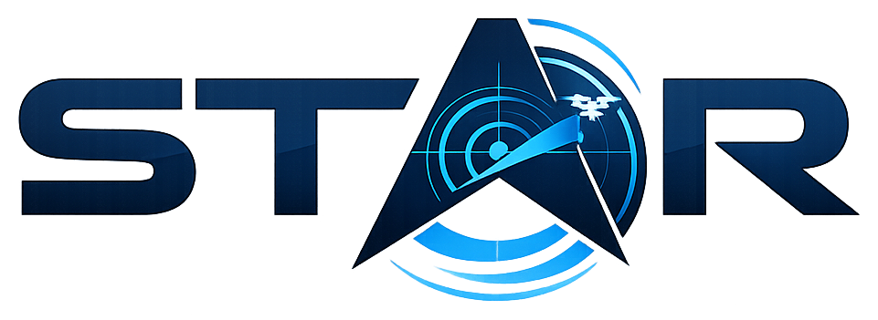
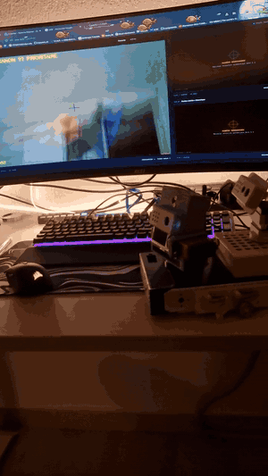
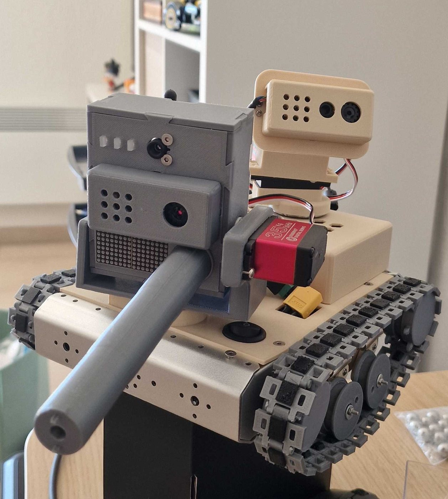
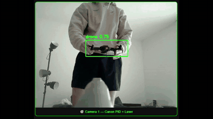
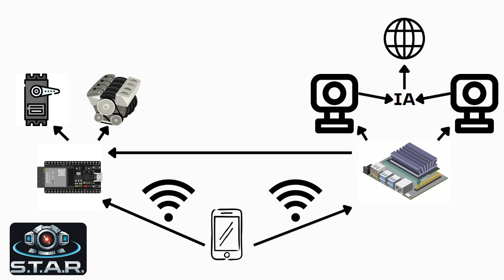
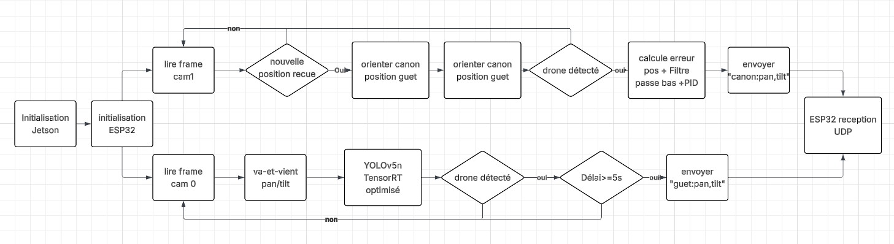
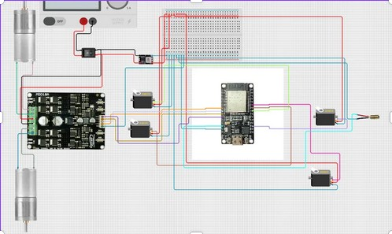

<p align="center">
  
</p>

<h3 align="center">Sentinel Track Alert Report — prototype V1</h3>

<p align="center">
  Tourelle robotisée qui détecte un drone à la caméra et le suit en temps réel.<br>
  Projet de robotique, Polytech Nice Sophia (2025-2026) — Antoine Pelissier
</p>

<p align="center">
  
  &nbsp;
  
</p>

<p align="center">
  <a href="https://tonio1547.github.io/projet.html?id=star">Page du projet sur mon portfolio</a> ·
  <a href="docs/rapport_final.pdf">Rapport final (PDF)</a> ·
  <a href="docs/presentation.pdf">Présentation (PDF)</a>
</p>

> **English summary** — S.T.A.R. V1 is a dual-turret robot that detects drones with a YOLOv5n model
> running on a Jetson Nano (TensorRT) and tracks them with a PID-controlled pan/tilt turret driven by an
> ESP32 over UDP. This repository contains the ESP32 firmware, the documentation, videos and the 3D model.
> A second version (V2) is in progress.

---

## Ce que fait la V1

Le robot embarque **deux tourelles** :

- **Tourelle de guet** : balaye en continu (pan 0–180°, tilt 90–150°) à la recherche d'un drone.
  Quand elle en voit un, la Jetson transmet sa position à la tourelle canon.
- **Tourelle canon** : s'oriente vers cette position, puis suit le drone elle-même grâce à sa caméra
  et à un **correcteur PID** avec filtre passe-bas.

La détection utilise un modèle **YOLOv5n fine-tuné sur des drones**, optimisé en **TensorRT**, sur les
flux de deux webcams. Le flux annoté est diffusé sur une **interface web Flask**, accessible depuis un
téléphone, qui permet aussi de piloter la base à chenilles.

| Vue de la caméra pendant le suivi | Détection sur les deux caméras |
|---|---|
|  | Vidéo : [`detection_deux_cameras.mp4`](media/videos/detection_deux_cameras.mp4) |

Autres vidéos : [`fonctionnement_1.mp4`](media/videos/fonctionnement_1.mp4) ·
[`fonctionnement_2.mp4`](media/videos/fonctionnement_2.mp4) ·
[`vue_camera_tracking.mp4`](media/videos/vue_camera_tracking.mp4)

## Architecture



- **Jetson Nano** : acquisition des deux caméras USB, détection YOLOv5n + TensorRT, calcul PID, interface Flask.
- **ESP32** : tâches bas niveau uniquement — 4 servomoteurs (2 tourelles), 2 moteurs DC via un pont en H
  Cytron MDD10A, laser.
- **Liaison** : WiFi, commandes UDP de la Jetson vers l'ESP32 (port 4210).



## Firmware ESP32 — [`firmware_esp32/`](firmware_esp32)

Projet PlatformIO (Arduino, ESP32 DevKit v1). Points notables :

- **Protocole UDP** : `canon2:seq,pan,tilt` et `guet2:seq,pan,tilt` (avec numéro de séquence pour ignorer
  les paquets arrivés en retard), `motor:gauche,droite`, `stop`, `center`, `status?`.
- **Sécurités** : butées angulaires dupliquées côté ESP32, watchdog moteurs (350 ms) et servos (1,2 s),
  sorties coupées en cas de perte du WiFi, laser jamais activable par le réseau.
- **Fluidité** : interpolation des servos à 100 Hz avec vitesse maximale par axe ; la file UDP est vidée à
  chaque boucle pour n'appliquer que la consigne la plus récente.
- **Stabilité électrique** : démarrage des servos un par un et vitesses limitées pour éviter les resets
  *brownout* ; puissance WiFi réduite.

### Compiler et flasher

1. Installer [PlatformIO](https://platformio.org/) (extension VS Code).
2. Copier `firmware_esp32/include/secrets.example.h` en `secrets.h` et y mettre le WiFi utilisé par la Jetson.
3. Ouvrir `firmware_esp32/` dans VS Code puis **Upload**. L'IP de l'ESP32 s'affiche dans le moniteur série (115 200 bauds).

## Matériel

| Composant | Qté | Prix unitaire |
|---|---|---|
| NVIDIA Jetson Nano | 1 | 250 € |
| Webcam Logitech C505e | 2 | 50 € |
| Servomoteurs | 4 | 15 € |
| Moteurs DC 10 V | 2 | 10 € |
| Pont en H Cytron MDD10A | 1 | 30 € |
| ESP32 | 1 | 5 € |
| Convertisseur buck (10 V → 5 V) | 1 | 2 € |
| Laser, interrupteur | 1 + 1 | 1 € |
| **Total** | | **≈ 469 €** |



## Difficultés rencontrées

- **Python 3.6 sur la Jetson Nano (JetPack 4.6)** : impossible d'utiliser Ultralytics YOLOv8, d'où YOLOv5 v6.2.
- **800 Mo libres sur le système** : PyTorch, TorchVision et YOLOv5 installés sur la carte SD via `PYTHONUSERBASE`.
- **Format de sortie du modèle** : un modèle entraîné avec un Ultralytics récent sort `(1, 5, 8400)` nommé `output0`,
  alors que YOLOv5 v6.2 attend `(1, 8400, 6)`. Correction du nom de sortie et **NMS réécrit à la main**
  (`torchvision.ops.nms`).
- **Réglage du PID** : inversions de signe liées au montage, puis gains ajustés empiriquement
  (Kp trop fort = dépassements, Kd trop faible = oscillations).
- **Démarrage automatique** : WiFi via NetworkManager, session automatique GDM3 et service systemd.

## Limites et suite

- Tracking encore saccadé : la Jetson Nano plafonne à 10–15 images/s.
- Base mobile pas entièrement opérationnelle, caméra thermique pas encore intégrée.
- **V2 en cours** : tourelle fixe, Jetson Orin NX, caméra à obturateur global, moteurs gimbal brushless
  en commande FOC — voir le [portfolio](https://tonio1547.github.io/projet.html?id=star).

## Contenu du dépôt

```
firmware_esp32/   firmware ESP32 (PlatformIO)
jetson/           code de la Jetson Nano (à venir)
cao/              modèle 3D de la V1 (.glb)
docs/             rapport final, présentation, schémas
media/            photos, GIF et vidéos
```

## Auteur

**Antoine Pelissier** — étudiant ingénieur en robotique autonome, Polytech Nice Sophia
[Portfolio](https://tonio1547.github.io) · [LinkedIn](https://www.linkedin.com/in/antoine-pelissier1)
